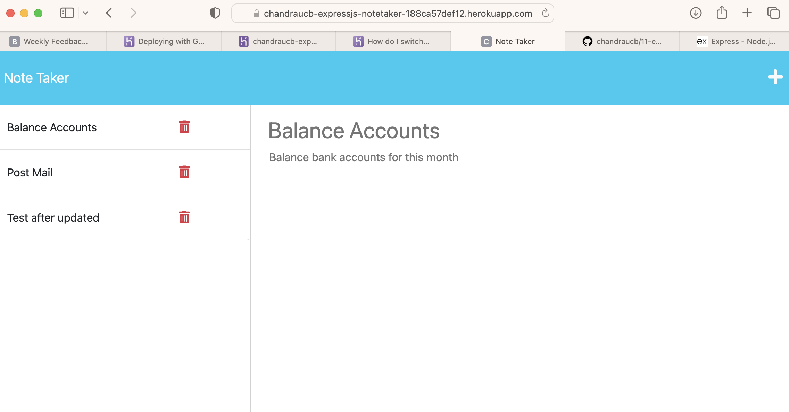

# 11-expressjs-note-taker

[](http://choosealicense.com/licenses/mit/)

## Description
An application to write and save notes. This application uses Express.js as back end and saves and retrieves notes data from a JSON file.

## Table of Contents
 - [Installation](#installation)
 - [Usage](#usage)
 - [Credits](#credits)
 - [License](#license)

## Installation
Clone the github repo as shown below, <br/><br/> ``` git clone git@github.com:chandraucb/11-expressjs-note-taker``` <br/><br/> Run node package install <br/><br/> ``` npm install ```

## Usage
Application is deployed using Heroku and can be accessed using below link, https://chandraucb-expressjs-notetaker-188ca57def12.herokuapp.com

 

## Credits
Heroku Deployment
https://help.heroku.com/O0EXQZTA/how-do-i-switch-branches-from-master-to-main <br/> ExpressJS 
https://expressjs.com

## License
Copyright (c) 2023 Chandrasekar Mohan
Licensed under the MIT License


## Questions 
  Name : Chandrasekar Mohan 
  Git profile : https://github.com/chandraucb 
  Contact email : chandrasekar.mohan@gmail.com 
  Reach me through email with additional questions

